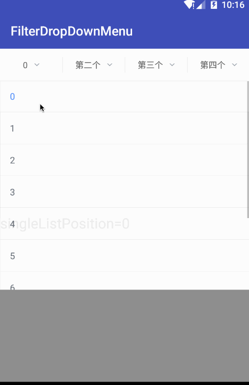

## DropDownMenu
[](https://android-arsenal.com/details/1/3803)


This is a DropDownMenu with the advantage of all the dropDownMenus by others before,
I have written it for several times, Now the code is most clearly.

[中文文档](README-cn.md)

##Feature
1. use Adapter to add the SubDropDownMenu. Override the `getView()` method to supply the wantted view.
2. use Generic to make all kinds of model(pojo,javabean...) can be used.
3. use FilterCheckedView which implements `Checkable`, so you can use selector to respond to all user action.
4. use FilterUrl to save the current choosen data, only override `toString()` you will get the url.

##ScreenShot


## Usage 
the xml: 
```xml
<com.baiiu.filter.DropDownMenu
    android:id="@+id/filterDropDownView"
    android:layout_width="match_parent"
    android:layout_height="match_parent">

    <TextView
        android:id="@id/mFilterContentView" //mFilterContentView must be add into the view.the view can be a RecyclerView or others.
        android:layout_width="match_parent"
        android:layout_height="match_parent"
        android:gravity="center_vertical"
        android:textSize="22sp" />
</com.baiiu.filter.DropDownMenu> 
```

the JavaCode:
```java
//set the Adapter.
dropDownView.setMenuAdapter(new DropMenuAdapter(this, titleList));
```

the DropMenuAdapter:
```java
@Override
public int getMenuCount() {
    return titles.length;
}

@Override
public String getMenuTitle(int position) {
    return titles[position];
}

@Override
public int getBottomMargin(int position) {
    return 0;
}

@Override
public View getView(int position, FrameLayout parentContainer) {
    ...
    return createSingleListView();
}
```

add a SingleListView:
```java
private View createSingleListView() {

    SingleListView<String> singleListView = new SingleListView<String>(mContext)
            .adapter(new SimpleTextAdapter<String>(null, mContext) {
                @Override
                public String provideText(String string) {
                    return string;
                }
            })
            .onItemClick(new OnFilterItemClickListener<String>() {
                @Override
                public void onItemClick(String item) {
                    FilterUrl.instance().singleListPosition = item;

                    FilterUrl.instance().position = 0;
                    FilterUrl.instance().positionTitle = item;

                    if (onFilterDoneListener != null) {
                        onFilterDoneListener.onFilterDone(0, "", "");
                    }
                }
            });
            
    //初始化数据
    singleListView.setList(list, -1);//默认不选中
}
```


## License
    Copyright (C) 2016 zhe zhu

    Licensed under the Apache License, Version 2.0 (the "License");
    you may not use this file except in compliance with the License.
    You may obtain a copy of the License at

       http://www.apache.org/licenses/LICENSE-2.0

    Unless required by applicable law or agreed to in writing, software
    distributed under the License is distributed on an "AS IS" BASIS,
    WITHOUT WARRANTIES OR CONDITIONS OF ANY KIND, either express or implied.
    See the License for the specific language governing permissions and
    limitations under the License.

